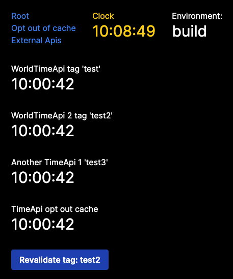

# Next Caching Tests

## Description

This repository contains a set of tests to evaluate the behavior of the Next.js 14.0.4
caching system with the new App Router. It has different routes and components,
client and server side, to test the different scenarios. 

## How to run

1. Clone the repository
2. `npm install`

### Development mode

- `npm run dev`

### Production mode

- `npm run bs`
